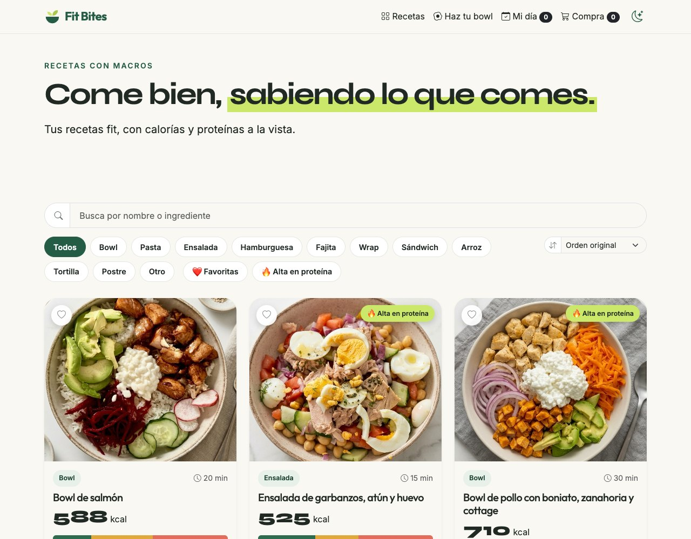
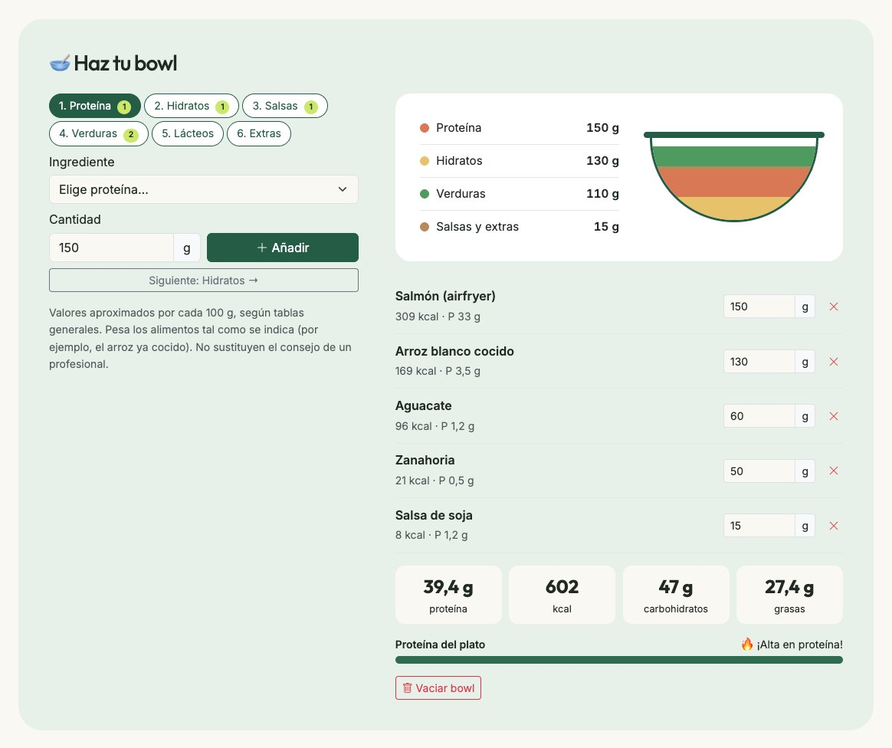
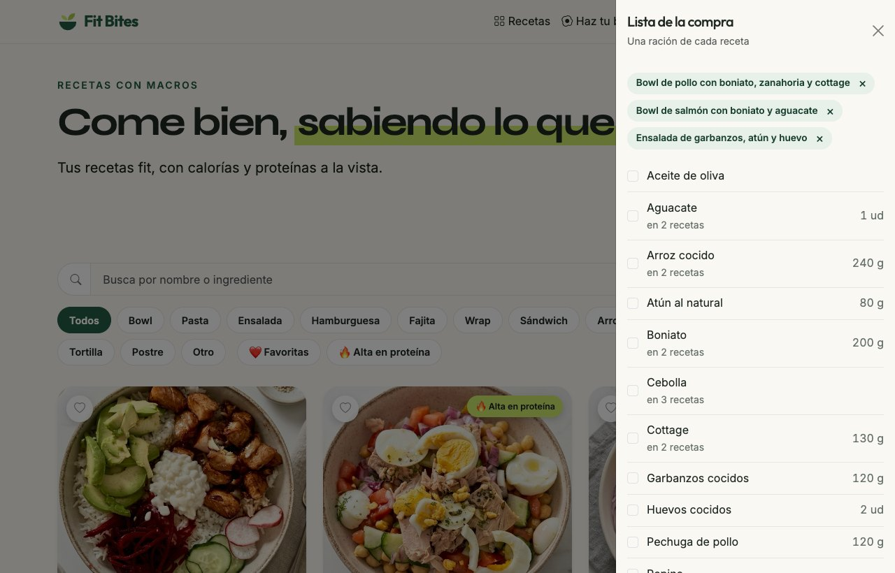
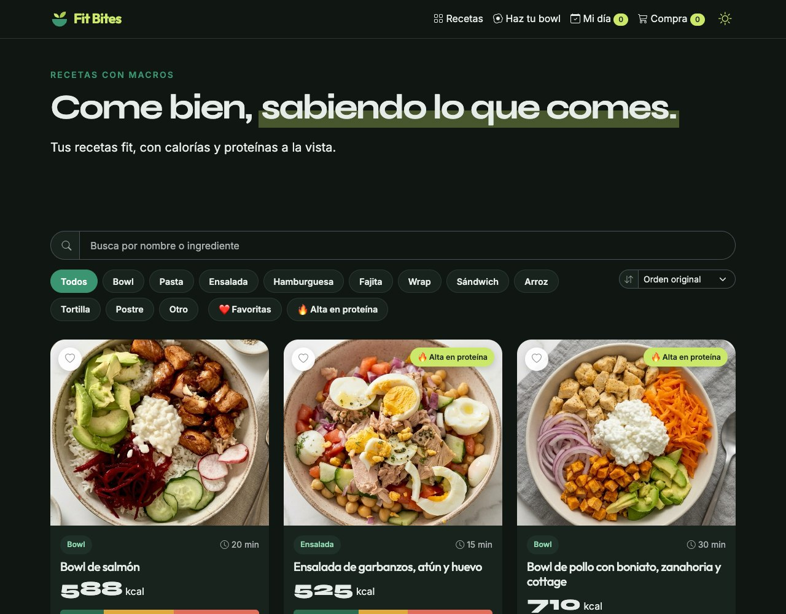
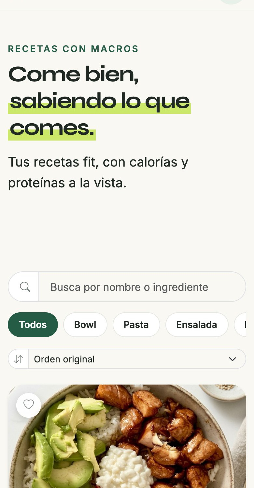
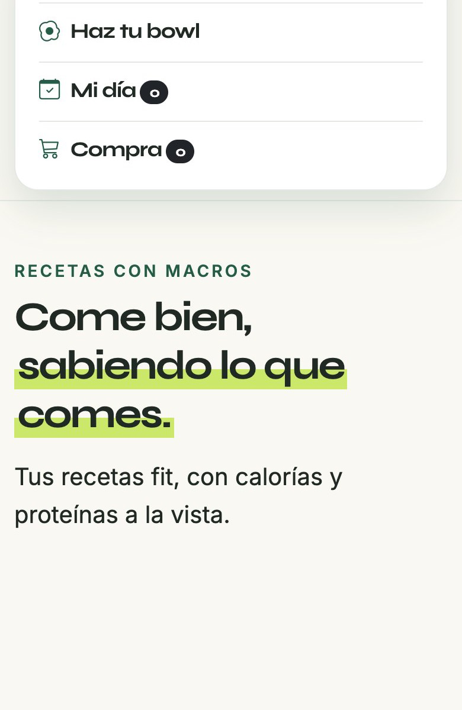

# 🥣 Fit Bites

**Recetas fit con las calorías y las proteínas a la vista.**
Una web app para guardar recetas con sus macros, montar tu propio bowl viendo cómo se suma la proteína en directo, llevar la cuenta de lo que comes en el día y preparar la lista de la compra.

👉 **[Ver la web en directo](https://taniadeazevedo.github.io/fit-bites/)** · se puede instalar en el móvil como una app.

> 📚 **Proyecto de aprendizaje.** Lo estoy construyendo para aprender desarrollo web (HTML, CSS, JavaScript y Bootstrap). Lo he ido haciendo paso a paso con ayuda de una IA, y el código está comentado línea a línea para poder leerlo y entenderlo.



## ✨ Qué hace

| | |
|---|---|
| 🍽️ **Recetas con macros** | Calorías, proteína, carbohidratos y grasas de cada receta, con una barra de reparto, foto, tipo de plato, tiempo e ingredientes. |
| ✏️ **CRUD completo** | Crear, editar y borrar recetas contra una API REST (`json-server`), con foto subida desde el formulario. |
| 🔎 **Filtros y orden** | Por tipo de plato, buscador (sin distinguir tildes) por nombre e ingredientes, 🔥 alta en proteína y ❤️ favoritas. Se puede ordenar por proteína, calorías, tiempo o nombre. |
| 🥣 **Haz tu bowl** | Eliges ingredientes por pasos (proteína, hidratos, salsas, verduras…), pones los gramos y ves al instante las kcal y los macros. Un cuenco dibujado se va llenando por capas. Se puede guardar como receta. |
| 📅 **Mi día** | Suma lo que comes y lo compara con tu objetivo diario (editable) con barras de progreso. |
| 🛒 **Lista de la compra** | Marcas varias recetas y junta los ingredientes sumando las cantidades (`120 g + 100 g de salmón = 220 g`). Se pueden ir tachando y copiar. |
| 🌙 **Modo oscuro** | Recuerda tu elección o usa la del sistema. |
| 📱 **App instalable (PWA)** | Se puede añadir a la pantalla de inicio y abrir sin internet. |

<table>
  <tr>
    <td></td>
    <td></td>
  </tr>
  <tr>
    <td></td>
    <td align="center">
      
      
    </td>
  </tr>
</table>

## 🛠️ Tecnologías

- **HTML5** semántico y **CSS3** (variables, flexbox, grid, animaciones, tema oscuro, diseño responsive)
- **JavaScript** moderno, sin frameworks: `fetch` con `async/await`, `localStorage`, `IntersectionObserver`, canvas para reducir las fotos, service worker
- **Bootstrap 5.3** y **Bootstrap Icons**
- **json-server** como API REST de pruebas
- **GitHub Pages** para publicarla
- Fuentes de Google Fonts: Syne, Outfit e Inter

## 🚀 Cómo ejecutarlo en local

1. Clona el repositorio y abre la carpeta en VS Code.
2. Abre `index.html` con la extensión **Live Server** (o con cualquier servidor estático).
3. Para poder **crear, editar y borrar** recetas, arranca la API en otra terminal:

   ```bash
   npx json-server json/recetas.json --port 3001
   ```

   Si no está encendida, la web funciona igualmente en **modo lectura**, que es lo que se ve en GitHub Pages (no hay servidor allí).

## 🗂️ Estructura

```
fit-bites/
├── index.html              # la página (con comentarios que explican cada parte)
├── css/estilos.css         # estilos: paleta, tarjetas, bowl, tema oscuro...
├── js/app.js               # toda la lógica, comentada línea a línea
├── json/
│   ├── recetas.json        # las recetas (la "base de datos" de json-server)
│   └── ingredientes.json   # tabla de ingredientes por 100 g para "Haz tu bowl"
├── imgs/recetas/           # fotos de las recetas
├── icons/ + manifest.webmanifest + sw.js   # app instalable (PWA)
└── docs/capturas/          # capturas de este README
```

## 🧠 Cómo está pensado

- **Mismo código en local y en la web publicada.** En local `app.js` habla con `json-server`; en GitHub Pages lee `json/recetas.json` como archivo y desactiva los botones de editar.
- **Lo personal se guarda en el navegador** (`localStorage`): Mi día, tu objetivo, favoritas, el bowl a medias, la lista de la compra y el tema. No hay cuentas ni servidor.
- **Fotos:** las que se suben desde el formulario se reducen en el navegador con un canvas antes de guardarlas; las de las recetas de ejemplo están en `imgs/recetas/`.
- **Offline:** el service worker guarda una copia al visitar la web. Usa la estrategia «primero la red»: si hay internet carga lo más nuevo, y si no, la copia guardada. Solo se registra en la web publicada, para no estorbar mientras se programa.

## 🎓 Lo que he ido aprendiendo

- Pedir y enviar datos con `fetch` y entender los métodos de una API REST (`GET`, `POST`, `PUT`, `DELETE`).
- Funciones asíncronas con `async/await` y manejo de errores con `try/catch`.
- Pintar la interfaz desde datos (plantillas de texto, `map`, `filter`, `reduce`, `sort`) y delegación de eventos.
- Guardar estado con `localStorage` y `JSON.parse` / `JSON.stringify`.
- Variables CSS, diseño responsive, animaciones y tema oscuro.
- Qué es un service worker y cómo funciona una PWA.
- Publicar con GitHub Pages y trabajar con Git.

## 🔭 Próximos pasos

- [ ] «Mi semana»: ver Mi día por días de la semana
- [ ] Gráfico semanal de proteína y calorías
- [ ] Escalar las raciones de cada receta

---

Valores nutricionales aproximados, introducidos por Tania y Cris. No sustituyen el consejo de un profesional.
